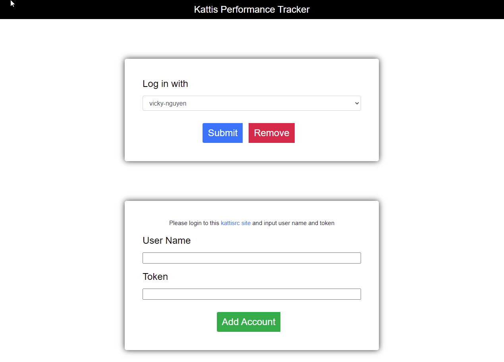
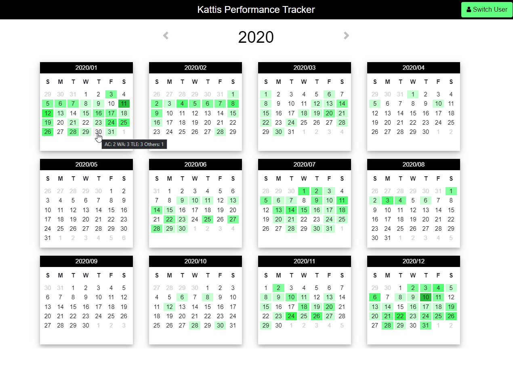
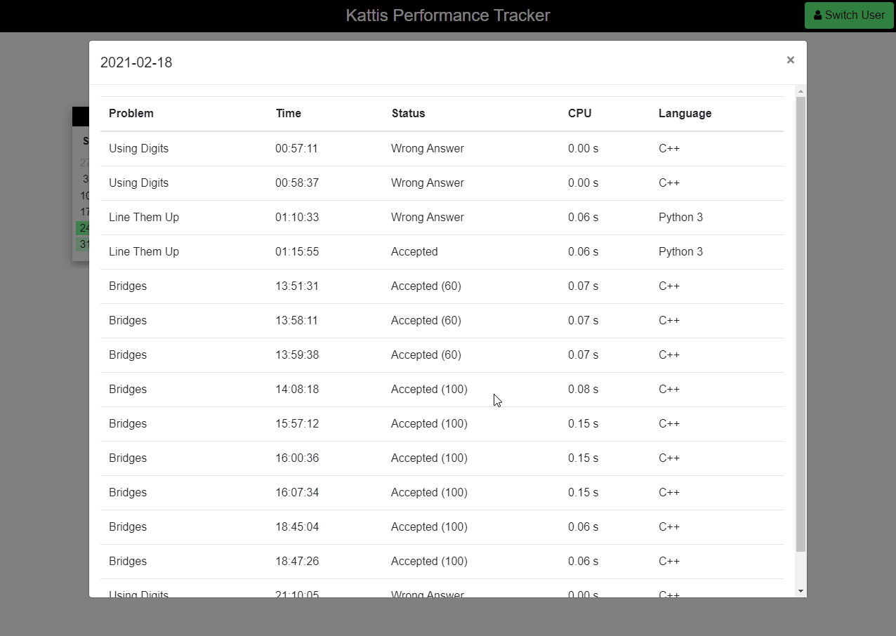

# Kattis Performace Tracker
Kattis Performace Tracker shows your [Kattis](https://open.kattis.com/) problem solving activity. You can switch between many Kattis accounts The color for the calendar is based on github contribution graph.

I built this project to keep track of my performance solving problems on open.kattis.com. Also, I wanted to try web scraping and to practice building a web application using Flask framework, SQLite database, and Python requests module.

I spent quite a large portion of my univeristy time on solving problems on open.kattis.com with a dream of ranking #1 among former and current students and professors at UVic. My dream came true before I graduated :blush:

Check out the [UVic Scoreboard](https://open.kattis.com/universities/uvic.ca).

## How to use
Log in [Kattis](https://open.kattis.com/download/kattisrc), go back to the app and enter your user name and token, then click "Add Account". You can add another account by log out of Kattis then log in with your other account.

*Login Page*

 

*Calendar View*

 

*Detail Information of a Day*
